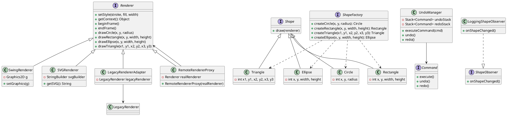

# 系统类图

## 关键类说明

### 渲染器相关
- `Renderer`: 定义统一的渲染接口
- `SwingRenderer`: 基于Swing的实现
- `SVGRenderer`: 生成SVG格式输出
- `LegacyRendererAdapter`: 适配旧版渲染器
- `RemoteRendererProxy`: 远程渲染代理

### 图形相关
- `Shape`: 图形基类接口
- `Circle`/`Rectangle`/`Triangle`/`Ellipse`: 具体图形实现

### 设计模式
- `ShapeFactory`: 工厂模式创建图形
- `Command`/`UndoManager`: 命令模式实现撤销重做
- `ShapeObserver`: 观察者模式通知变化

## 如何查看图表

1. 安装PlantUML插件(VSCode/IntelliJ等)
2. 或使用在线PlantUML渲染器
3. 将代码复制到编辑器中即可生成图表
