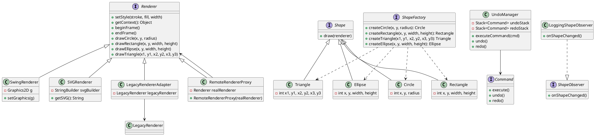
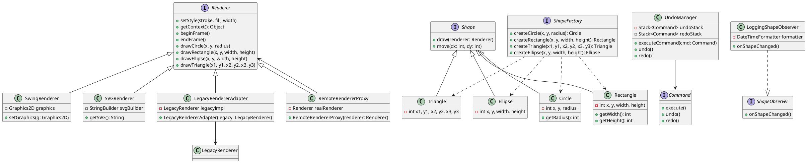

# 系统类图



## 关键类说明

### 渲染器相关
- `Renderer`: 定义统一的渲染接口
- `SwingRenderer`: 基于Swing的实现
- `SVGRenderer`: 生成SVG格式输出
- `LegacyRendererAdapter`: 适配旧版渲染器
- `RemoteRendererProxy`: 远程渲染代理

### 图形相关
- `Shape`: 图形基类接口
- `Circle`/`Rectangle`/`Triangle`/`Ellipse`: 具体图形实现

### 设计模式
- `ShapeFactory`: 工厂模式创建图形
- `Command`/`UndoManager`: 命令模式实现撤销重做
- `ShapeObserver`: 观察者模式通知变化

## 如何查看图表

1. 安装PlantUML插件(VSCode/IntelliJ等)
2. 或使用在线PlantUML渲染器
3. 将代码复制到编辑器中即可生成图表
# 系统类图文档



## 类说明

### 1. 渲染器相关
- **Renderer**: 定义统一的渲染接口
- **SwingRenderer**: 基于Java Swing的实现
- **SVGRenderer**: 生成SVG格式输出
- **LegacyRendererAdapter**: 适配旧版渲染器
- **RemoteRendererProxy**: 远程渲染代理

### 2. 图形相关
- **Shape**: 图形基类接口
- **Circle**: 圆形实现
- **Rectangle**: 矩形实现
- **Triangle**: 三角形实现
- **Ellipse**: 椭圆实现

### 3. 工厂模式
- **ShapeFactory**: 图形创建工厂接口

### 4. 命令模式
- **Command**: 命令接口
- **UndoManager**: 撤销/重做管理器

### 5. 观察者模式
- **ShapeObserver**: 观察者接口
- **LoggingShapeObserver**: 日志观察者实现

## 关键关系说明

1. **实现关系**:
   - 所有具体渲染器实现`Renderer`接口
   - 所有具体图形实现`Shape`接口

2. **适配关系**:
   - `LegacyRendererAdapter`适配`LegacyRenderer`到`Renderer`接口

3. **代理关系**:
   - `RemoteRendererProxy`代理真实的`Renderer`实现

4. **工厂关系**:
   - `ShapeFactory`负责创建各种图形对象

5. **命令模式**:
   - `UndoManager`管理`Command`对象的执行历史

6. **观察者模式**:
   - `LoggingShapeObserver`实现`ShapeObserver`接口

## 如何使用

1. 安装PlantUML插件(VSCode/IntelliJ等)
2. 将上述代码复制到`.puml`文件中
3. 使用插件渲染生成类图

```bash
# 生成PNG图片
plantuml class-diagram.puml -png
```

> 注意：需要先安装PlantUML，在Ubuntu上可以使用`sudo apt-get install plantuml`
