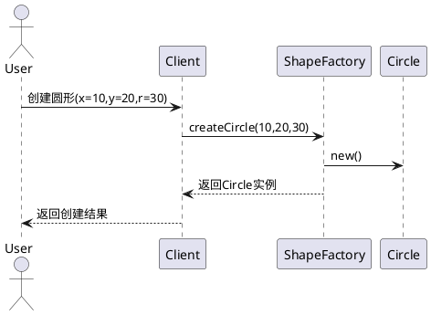
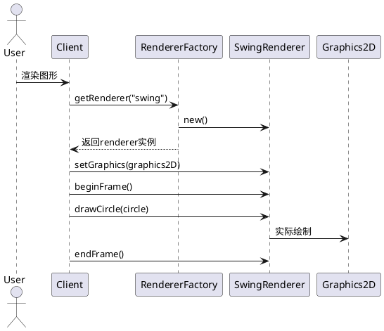
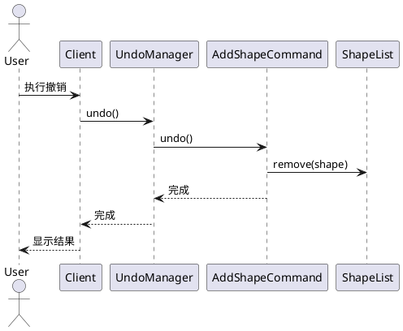
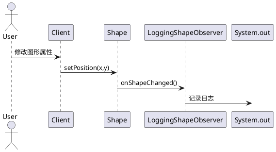
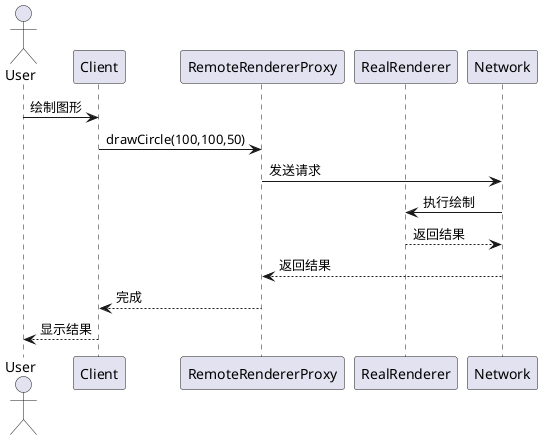

# 系统序列图

## 1. 图形创建流程



## 2. 图形渲染流程



## 3. 撤销操作流程



## 4. 观察者通知流程



## 5. 远程渲染代理流程



## 如何使用

1. 安装PlantUML插件(VSCode/IntelliJ等)
2. 将上述代码复制到`.puml`文件中
3. 使用插件渲染生成序列图

```bash
# 生成PNG图片
plantuml sequence-diagrams.puml -png
```

> 注意：需要先安装PlantUML，在Ubuntu上可以使用`sudo apt-get install plantuml`
